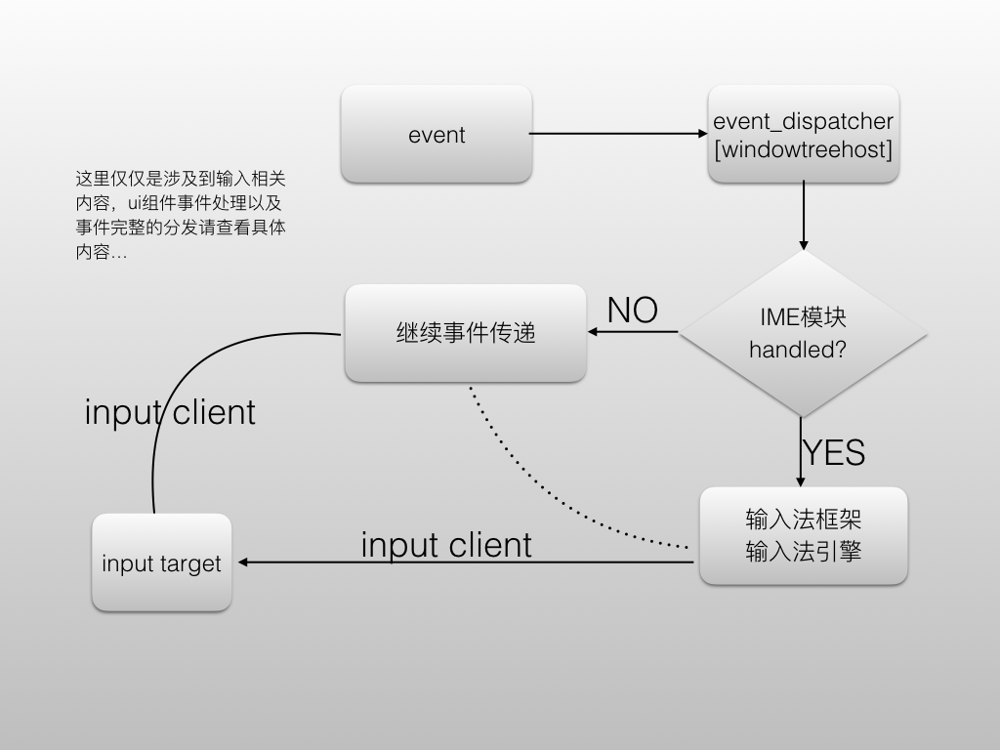

# 为chromium对接自己的输入法

按照一般情况，基于chromium［content－shell］开发是不需要考虑输入法的对接的，chromium project中早就为各个平台做了对接；每个平台都通过 **InputContext** 实现了与各个系统的衔接；

万事都有例外，比如说工作中的情况；因为我们的产品是跑在**裸奔**状态下的linux；没有DE（desktop environments）没有**gtk、x11；** 所以自然而然没有`gtk_im_context_focus_in(gtk_context_);`来让直接使用输入法; 在图形的backend也没有glwindow之类的东西啦，使用的是directfb这个轻量级硬件图形加速库，所以我们真实的环境是：

* 没有Desk-environment
* 没有现有的输入法framework
* 没有现有的ime 输入法引擎

篇幅有限，此文仅仅介绍输入法的对接，也就是说事件怎么给输入法，以及输入法怎么和整个事件分发过程结合起来；开始之前，我们看一下整个框架的介绍，以便我们之后结合代码进行分析；



chromium中event中通过`platform_event_source`来与系统事件系统对接，在x11系统中通过`glib_source_xxxx`系列函数向系统注册事件回调， 所以这部分各个平台实现不一样， 不过原理思路都相当清晰；这里就不再赘述， 从系统拿到事件之后， 则通过eventsource对象向添加了侦听的`PlatFormEventObserver`对象和`PlatformEventDispatcher` 对象来dispachEvent；window\_tree\_host就是这样的的一个事件分发者；我们的分析也是从这里开始；首先在DisPatchEvent函数中则是判断事件类型啦， 因为对于输入法来说， 我们只关心keyevent事件，mouse事件或者其他类型的touch事件等等，都不是输入法事件关系的，所以这部分也排除在分析之外；

```c
uint32_t DeskTopWindowTreeHostXXX::DispatchEvent(const ui::PlatformEvent& event) {
  ...
  ... 
  switch() {
    ...
    case KeyPress: {
      ui::KeyEvent keydown_event(xev);
      DispatchKeyEvent(&keydown_event);
      break;
    }
    case KeyRelease: {
      // There is no way to deactivate a window in X11 so ignore input if
      // window is supposed to be 'inactive'.
      if (!IsActive() && !HasCapture())
        break;

      ui::KeyEvent key_event(xev);
      DispatchKeyEvent(&key_event);
      break;
    }
    ...
    ...
  }
}

void DesktopWindowTreeHostXXX::DispatchKeyEvent(ui::KeyEvent* event) {
  GetInputMethod()->DispatchKeyEvent(event);
}
```

从上面的代码中，首先我们只关注了keypress与keyrelease事件；代码中首先是通过ui::keyEvent的构造函数将事件从platformEvent转化成了ui::KeyEvent,之后通过`DisPatchKeyEvent()`函数来分发按键事件；在DispatchKeyEvent函数中， 则调用inputmethod的DispachKeyEvent的接口， 将事件传递给chormium project内部的ime系统；这里的函数`GetInputMethod()`返回给我们一个`ui::InputMethod*`对象；它定义了一些列的和输入法对接的抽象的接口；比如说Onfocus,OnBlur,GetTextInputType,ShowImeIfNeeded,GetTextInputClient等等接口

chromium中`InputMethod`对象定义了输入法的通用接口，在头文件`src/ui/base/ime/input_method.h`下每个api都提供了详细的注视说明， 估计如果看完这些说明， 就能能清晰的了解它背后的实现逻辑了；  


InputMethodBase则继承InputMethod对象，并实现了一些抽象的与平台无关的逻辑；自从google为了更好的兼容各个平台，从而抽象出来了aura这个逻辑模块；从32开始逐步的完善了整个结构，到现在的v54几乎都已经很完善了， 所以在这个基础之上， 有了继承自`InputMethodBase`的`InputMethodAuraLinux`和为chromeOs准备的`InputMethodChromeOs`对象， 这里我们关注InputMethodAuraLinux这个对象；InputMethodAuraLinux对象继承了`InputMethodBase`之外还继承了`LinuxInputMethodContextDelegate`对象；从字面意义上看它是LinuxInputMethodContext的一个委托，儿InputMethodContext就是我们输入法的上下文；这个部分我们待会儿分析；先来看看InputMethodAuraLinux做了些什么；

```c
class UI_BASE_IME_EXPORT InputMethodAuraLinux
    : public InputMethodBase,
      public LinuxInputMethodContextDelegate {
  ...
  // Overriden from InputMethod.
  bool OnUntranslatedIMEMessage(const base::NativeEvent& event,
                                NativeEventResult* result) override;
  void DispatchKeyEvent(ui::KeyEvent* event) override;
  void OnTextInputTypeChanged(const TextInputClient* client) override;
  void OnCaretBoundsChanged(const TextInputClient* client) override;
  void CancelComposition(const TextInputClient* client) override;
  bool IsCandidatePopupOpen() const override;

  // Overriden from ui::LinuxInputMethodContextDelegate
  void OnCommit(const base::string16& text) override;
  void OnPreeditChanged(const CompositionText& composition_text) override;
  void OnPreeditEnd() override;
  void OnPreeditStart() override{};
  ...
private:
  ...
  ...
  std::unique_ptr<LinuxInputMethodContext> context_;
  // The current text input type used to indicates if |context_| and
  // |context_simple_| are focused or not.
  TextInputType text_input_type_;
}
```

从上面可以看出， InputMethodAuraLinux Override InputMethodBase的接口非常少；从名字就能看出来，一个是分发事件给真正的输入法的接口，接收输入状态变化的接口，可输入对象的大小位置变化的接口，还有一个取消当前输入内容的接口，以及一个判断当前输入法是否弹出来的接口；除此之外就没有其他的接口了， 因为从我们最上面第一张图就能看出， 这里作为一个输入法具体实现的一个桥梁， 我们只需要告诉具体的输入法输入类型变化，可输入框的位置变化｛ps：以便在正确的地方弹出候选词框｝已经取消没有提交的输入｛ps： 比如输入中文的时候弹出候选词后，按esc键取消输入｝以及在可输入状态的时候通过`void DispatchKeyEvent(ui::KeyEvent* event) override;`接口将事件传递给具体的输入法；

说明：

> 在inputmethod中， 还定义了Onfocus，Onblur的接口来表明输入框获得焦点和失去焦点等等，但是这部分的实现在最新的chromium项目中是为ChromeOS准备的， 而且这一部分最近变动比较大， 从这点也可以看出， google接下来在chromeos上的一些动作，有时候也不得不一遍又一遍的感叹google的能力；从我工作中的之前的版本v39到现在的最新版本v53，可以说就连这些基础的调整也非常大，在v39上，这部分的逻辑远没有现在这么清晰；

而InputMethodAuraLinux中还继承了LinuxInputMethodContextDelegate接口；从接口上就能看出，这是为InputMethodContext｛也就是我们具体的输入法［上下文］｝提交我们输入的内容的接口；以及我们`preedit`变化后通知给输入框的接口［OnPreeditChanged\(\)］；不太理解这个看下面这张图：  
  
其中上图中先是在网页输入框中的`nihao`就是通过这个接口传递上去的；

除此之外，InputMethodAuraLinux中还**拥有管理维护**着一个LinuxInputMethodContext的对象；而这个对象我们就可以认为是和我们输入法最亲近的一层啦；来！先看看这个类的第一句说明：

```
// An interface of input method context for input method frameworks on
// GNU/Linux and likes.
```

简单明了，就是一个在类unix／linux上的输入法的接口；因为我们**裸奔**的系统， 没有系统级的输入法；那么这个就是我们的接入点， 在这里通过LinuxInputMethodContext来实现我们自己的输入法就行了；儿chromium项目中**温馨**的提供了注册factory的接口`static void SetInstance(const LinuxInputMethodContextFactory* instance);` 通过注册LinuxInputMethodContextFactory对象， 我们就能创建我们自己的输入法上下文；从而实现对接，实在是太太太贴心了， 不过，本来就该这样设计，不是么...;

现在我们就能来瞅一眼它（LinuxInputMethodContext）到到底有什么；

```c
// An interface of input method context for input method frameworks on
// GNU/Linux and likes.
class UI_BASE_IME_EXPORT LinuxInputMethodContext {
 public:
  virtual ~LinuxInputMethodContext() {}

  // Dispatches the key event to an underlying IME.  Returns true if the key
  // event is handled, otherwise false.  A client must set the text input type
  // before dispatching a key event.
  virtual bool DispatchKeyEvent(const ui::KeyEvent& key_event) = 0;

  // Tells the system IME for the cursor rect which is relative to the
  // client window rect.
  virtual void SetCursorLocation(const gfx::Rect& rect) = 0;

  // Resets the context.  A client needs to call OnTextInputTypeChanged() again
  // before calling DispatchKeyEvent().
  virtual void Reset() = 0;

  // Focuses the context.
  virtual void Focus() = 0;

  // Blurs the context.
  virtual void Blur() = 0;
};
```

好吧，看到这里我想肯定心里在嘀咕，原来对接上自己的输入法就只要实现这么几个接口就ok了；用眼睛一眼就能看出来大概`Focus／Blur`这个不用说了吧；像我们没有实体键盘的，那就是`显示／隐藏`软键盘啦. 其实逻辑的重点在函数`bool DispatchEvent(const ui::keyEvent& key_ev);`中；从函数的说明来看，如果按键事件传递进去被底层的输入法处理掉的话就返回true，没有处理就返回false；这里我们参看一下x11/gtk上的逻辑；

```c
bool X11InputMethodContextImplGtk2::DispatchKeyEvent(
    const ui::KeyEvent& key_event) {
  if (!key_event.HasNativeEvent() || !gtk_context_)
    return false;

  // Translate a XKeyEvent to a GdkEventKey.
  GdkEvent* event = GdkEventFromNativeEvent(key_event.native_event());
  if (!event) {
    LOG(ERROR) << "Cannot translate a XKeyEvent to a GdkEvent.";
    return false;
  }

  if (event->key.window != gdk_last_set_client_window_) {
    gtk_im_context_set_client_window(gtk_context_, event->key.window);
    gdk_last_set_client_window_ = event->key.window;
  }

  // Convert the last known caret bounds relative to the screen coordinates
  // to a GdkRectangle relative to the client window.
  gint x = 0;
  gint y = 0;
  gdk_window_get_origin(event->key.window, &x, &y);
  GdkRectangle rect = {last_caret_bounds_.x() - x,
                       last_caret_bounds_.y() - y,
                       last_caret_bounds_.width(),
                       last_caret_bounds_.height()};
  gtk_im_context_set_cursor_location(gtk_context_, &rect);

  const bool handled =
      gtk_im_context_filter_keypress(gtk_context_, &event->key);
  gdk_event_free(event);
  return handled;
}
// .h file

  CHROMEG_CALLBACK_1(X11InputMethodContextImplGtk2, void, OnCommit,
                     GtkIMContext*, gchar*);
  CHROMEG_CALLBACK_0(X11InputMethodContextImplGtk2, void, OnPreeditChanged,
                     GtkIMContext*);
  CHROMEG_CALLBACK_0(X11InputMethodContextImplGtk2, void, OnPreeditEnd,
                     GtkIMContext*);
  CHROMEG_CALLBACK_0(X11InputMethodContextImplGtk2, void, OnPreeditStart,
                     GtkIMContext*);
```

抛开函数前面那些判断和事件转化；其中做的事情就是，通过将输入框的位置转化成一个屏幕的绝对位置；并通过`gtk_im_context_set_cursor_location(gtk_context_, &rect);`告诉输入法输入框的位置；最后调用`const bool handled = gtk_im_context_filter_keypress(gtk_context_, &event->key);`将按键事件传递给输入法；输入法根据当前的语言等信息调用输入法语义引擎来完成候选词的筛选；最后通过上面代码块中注册进去的callback函数，通过OnCommit，OnpreeditChanged，OnpreeditEnd，OnpreeditStart来反馈结果；

看完整体的过程，我们现在可以从InputMethodAuraLinux中来分析一下， 哪些事件是传递给了输入法，哪些事件又是怎么传递到原来的事件分发过程中去的；以及我们的输入结果是怎么提交到输入框的；

```c
void InputMethodAuraLinux::DispatchKeyEvent(ui::KeyEvent* event) {
  DCHECK(event->type() == ET_KEY_PRESSED || event->type() == ET_KEY_RELEASED);

  // If no text input client, do nothing.
  if (!GetTextInputClient()) {   //@pos 1
    ignore_result(DispatchKeyEventPostIME(event));
    return;
  }

  if (!event->HasNativeEvent() && sending_key_event_) {  //@pos 2
    // Faked key events that are sent from input.ime.sendKeyEvents.
    ui::EventDispatchDetails details = DispatchKeyEventPostIME(event);
    if (details.dispatcher_destroyed || details.target_destroyed ||
        event->stopped_propagation()) {
      return;
    }
    if ((event->is_char() || event->GetDomKey().IsCharacter()) &&
        event->type() == ui::ET_KEY_PRESSED) {
      GetTextInputClient()->InsertChar(*event);
    }
    return;
  }

  suppress_next_result_ = false;
  composition_changed_ = false;
  result_text_.clear();

  bool filtered = false;
  { //@pos 3
    base::AutoReset<bool> flipper(&is_sync_mode_, true);
    if (text_input_type_ != TEXT_INPUT_TYPE_NONE &&
        text_input_type_ != TEXT_INPUT_TYPE_PASSWORD) {
      filtered = context_->DispatchKeyEvent(*event);
    } else {
      filtered = context_simple_->DispatchKeyEvent(*event);
    }
  }


    // @pos 4  

  // If there's an active IME extension is listening to the key event, and the
  // current text input client is not password input client, the key event
  // should be dispatched to the extension engine in the two conditions:
  // 1) |filtered| == false: the ET_KEY_PRESSED event of non-character key,
  // or the ET_KEY_RELEASED event of all key.
  // 2) |filtered| == true && NeedInsertChar(): the ET_KEY_PRESSED event of
  // character key.
  if (text_input_type_ != TEXT_INPUT_TYPE_PASSWORD &&
      GetEngine() && GetEngine()->IsInterestedInKeyEvent() &&
      (!filtered || NeedInsertChar())) {
    ui::IMEEngineHandlerInterface::KeyEventDoneCallback callback = base::Bind(
        &InputMethodAuraLinux::ProcessKeyEventByEngineDone,
        weak_ptr_factory_.GetWeakPtr(), base::Owned(new ui::KeyEvent(*event)),
        filtered, composition_changed_,
        base::Owned(new ui::CompositionText(composition_)),
        base::Owned(new base::string16(result_text_)));
    GetEngine()->ProcessKeyEvent(*event, callback);
  } else {
    ProcessKeyEventDone(event, filtered, false);
  }
}
```

InputClient的说明：

> 在chromium project中， 所有的可输入对象都继承自TextInputClient这个基类， 比如说机遇aura的toolkit图形库中的TextField，还有导入到`webkit／blink`中的 `RenderWidgetHostViewAura`对象；它们都是基层自`TextInputClient`这个基类；我们这里暂且简单的把它想象成输入框即可，不管是页面的，还是说是机遇aura的toolkit绘制的这些UI控件， 感兴趣的可以自行去看看这方面的内容， 因为Chrome的这种设计上的对进程架构，我们的字符串如何从`输入法->inputClient[RenderWidgetHostViewAura]－>IPC->Blink`这部分内容感兴趣的也可以看看；这里就不便在扩展展开了；

首先，看我上面代码中`@pos 1`位置;如果GetInputClient为NULL的话， 那么我们就可以认为这不是一个可输入的；也就是说，当前focus的对象可能就是一个Button，Lable 或者是个 Image等等， 我们不需要输入，那么这里就调用了`ignore_result(DispatchKeyEventPostIME(event));`后就直接返回了； 从这个函数的名字就可以看出， 这个就是说一个事件一旦不需要输入法处理，就传递到 DispatchKeyEventPostIME 函数中；

上面代码中`@pos 2`位置的代码则是来自于嵌入到chromium 内部的输入法引擎通过InputMethod提供的函数`SendKeyEvnet`抛出的假的keyevent， 因为从嵌入到chromium中的输入法引擎构造的event中不含有Native的事件；因为这部分现在主要是用在chromeOS上， 所以这里也不展开了；自行研究，我这里仅仅给出一个大致的调用栈的截图; 这里其实是一个chrome的extension软键盘来的；  
  
所以在pos2这个代码块中，便没有将事件传递给IME模块了因为它本身就是从潜入的ime引擎来的， 而是直接调用的`DispatchKeyEventPostIME(event);` 根据返回的结果中`dipatcher_destroyed || target_distoryed`来决定是否继续这个事件， 如果这个事件是一个char事件，且拥有可输入的domkey，就在Keypress的时候，通过InputClient输入到输入框中去；输入框根据自己的办法来合成与绘制这些输入的内容；

如果事件经过了pos2 那么就直接返回了， 不会走下面的pos3； 在pos3 中，虽然代码中有一个context［InputMethodContext对象，也就是我们的输入法啦］，和另外一个context\_simple，这只是针对输入的内容区别而已， 我们可以只看其中的一条逻辑就好；如果这个事件被inputmethodcontext［我们的输入法］处理了，就返回true；这在我们上面的分析中已经确定了；

在上面的pos2中我们知道， 如果嵌入到浏览器的输入法引擎发送过来的事件在pos2就返回了，而引擎要死想侦听native的按键怎么办呢， 这就是接下来在pos 4中的这部分内容了，chrome中嵌入到浏览器中的输入法引擎如果想侦听native的事件，那么通过`GetEngine()->IsInterestedInKeyEvent()`返回true，以及其它一些条件就可以将事件通过`GetEngine()->ProcessKeyEvent(*event, callback);`传递到嵌入到浏览器的输入法引擎中， 并通过base::bind方法，传递进去一个callback函数；以便引擎处理完之后通过回调函数将结果通过InputMethodAuraLinux中的函数`ProcessKeyEventByEngineDone`传递回来； 如果没有走嵌入的输入法引擎，那么久在我们InputMethodContext处理之后，直接调用`ProcessKeyEventDone(event, filtered, false);`来继续处理和分发这个event事件；这个函数最后一个参数`bool is_handled`如果为true的话， 待变这个事件完全被handled了， 那么久直接返回， 结束了整个事件分发；如果输入法没有处理，那么就按照默认的事件逻辑处理｛ps：比如有的没有输入法，那么输入native event `a` 则依旧需要一个默认的处理逻辑决定是否需要插入到inputclient中或者根本就不是可输入的，即inpuclient＝＝NULL， 那么直接调用函数`event->StopPropagation();`彻底的结束事件的分发｝;具体请自行分析这个函数的内容了；

上面我们还残留着一点点小的内容，就是在上面的DipatchKeyEvent中如果inputclient==NULL， 也就是说；不是可输入的内容，通过`InputMethodBase::DispatchKeyEventPostIME`, 它做了些什么；这虽然和我们输入法不相关， 但是这部分内容也值得稍作分析：

```c
//file :   src/ui/base/ime/input_method_base.cc

ui::EventDispatchDetails InputMethodBase::DispatchKeyEventPostIME(
    ui::KeyEvent* event) const {
  ui::EventDispatchDetails details;
  if (delegate_)
    details = delegate_->DispatchKeyEventPostIME(event);
  return details;
}

//file :    src/ui/aura/window_tree_host.cc

ui::EventDispatchDetails WindowTreeHost::DispatchKeyEventPostIME(
    ui::KeyEvent* event) {
  return SendEventToProcessor(event);
}
```

也就是说；如果是没有inputclient，那么事件则通过delegate返回给windowtreehost， 而windowtreehost则将事件通过函数`SendEventToProcessor(event)`发送给`EventProcessor`对象处理，而在aura的toolkit框架下， 则是将事件分发给了RootView\[继承EventProcessor\]对象；rootview通过focusmanager，将事件传递给拥有focus的view对象， 调用通过view的DipatchEvent函数，分发给view对象， 如果不处理则继续分发给他的父view处理；知道被处理或者丢弃为止；最终响应keyevent的是view对象则通过OnKeyEvent来处理按键事件；这一部分就不再详细展开；如果感兴趣或者有功夫仔细研究一番， 我想一定有所收获的，包括设计模式与代码分层等等；

```c
//file : ui/events/event_source.cc 上面的代码中调用SendEventToProcessor(event);即event_source中的这个函数， windowtreehost继承自EventSource;

EventDispatchDetails EventSource::SendEventToProcessor(Event* event) {
  std::unique_ptr<Event> rewritten_event;
  EventRewriteStatus status = EVENT_REWRITE_CONTINUE;
  EventRewriterList::const_iterator it = rewriter_list_.begin(),
                                    end = rewriter_list_.end();
  for (; it != end; ++it) {
    status = (*it)->RewriteEvent(*event, &rewritten_event);
    if (status == EVENT_REWRITE_DISCARD) {
      CHECK(!rewritten_event);
      return EventDispatchDetails();
    }
    if (status == EVENT_REWRITE_CONTINUE) {
      CHECK(!rewritten_event);
      continue;
    }
    break;
  }
  CHECK((it == end && !rewritten_event) || rewritten_event);
  EventDispatchDetails details =
      DeliverEventToProcessor(rewritten_event ? rewritten_event.get() : event);
  if (details.dispatcher_destroyed)
    return details;

  while (status == EVENT_REWRITE_DISPATCH_ANOTHER) {
    std::unique_ptr<Event> new_event;
    status = (*it)->NextDispatchEvent(*rewritten_event, &new_event);
    if (status == EVENT_REWRITE_DISCARD)
      return EventDispatchDetails();
    CHECK_NE(EVENT_REWRITE_CONTINUE, status);
    CHECK(new_event);
    details = DeliverEventToProcessor(new_event.get());
    if (details.dispatcher_destroyed)
      return details;
    rewritten_event.reset(new_event.release());
  }
  return EventDispatchDetails();
}
```


